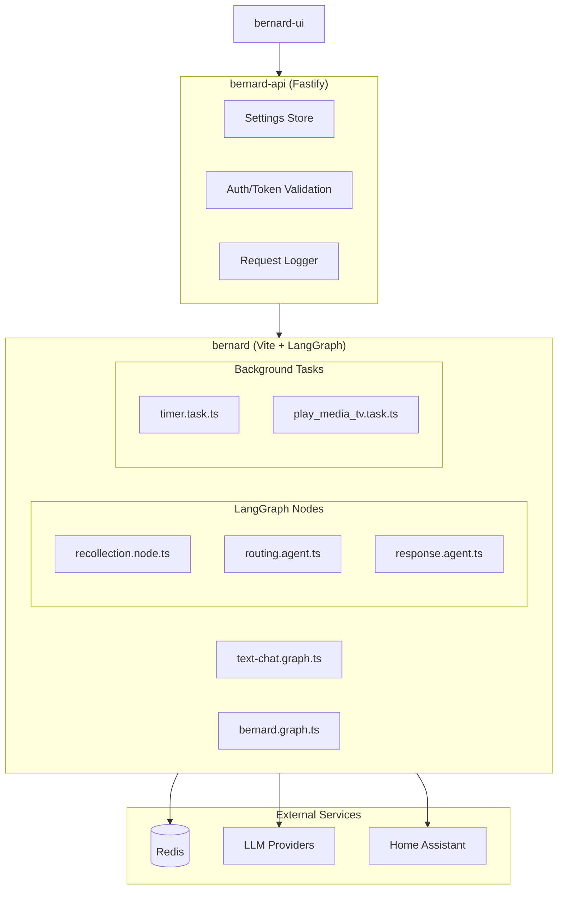
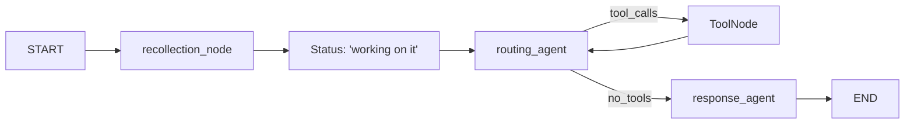

# Bernard LangGraph Redesign

## Architecture Overview




## Key Changes

### 1. Remove Components

- `agent/recordKeeper/` - conversation.keeper.ts, task.keeper.ts
- `lib/automation/` - entire directory (hookService, queue, registry, executor, types)
- `agent/automations/` - flagConversation, indexConversation, summarizeConversation, tagConversation
- `agent/queueWorker.ts`, `agent/queueWorkerMain.ts`
- `agent/harness/` - router/, respond/, recollect/ (replaced by LangGraph nodes)
- `agent/loop/orchestrator.ts` (replaced by LangGraph graphs)

### 2. New Service: `services/bernard-api/`

A Fastify-based central API service handling:

- Settings management (moved from bernard)
- User authentication validation
- Request logging
- Proxy coordination

**Key files:**

- `src/index.ts` - Fastify server setup
- `src/routes/settings.ts` - Settings CRUD
- `src/routes/auth.ts` - Auth validation endpoints
- `src/lib/settingsStore.ts` - Redis-backed settings

### 3. Bernard Service Refactor (Vite)

Convert from Next.js to Vite with the following structure:

```javascript
services/bernard/
  src/
    agent/
      node/
        recollection.node.ts    # Memory gathering via LangGraph Memory
      routing.agent.ts          # Tool selection/execution
      response.agent.ts         # Creative response generation
    graph/
      bernard.graph.ts          # Voice assistant (fast response)
      text-chat.graph.ts        # Text chat (detailed tracing)
      state.ts                  # Shared state definitions
    task/
      timer.task.ts             # Existing
      play_media_tv.task.ts     # Existing
    tool/
      ...                       # Existing tools (unchanged)
    llm/
      ...                       # Existing LLM callers
    streaming/
      types.ts                  # Simplified event types
      sse.ts                    # SSE stream creation
    lib/
      ...                       # Shared utilities
  server.ts                     # Vite server entry
  vite.config.ts
```


### 4. LangGraph State Definition

```typescript
// state.ts
import { Annotation } from "@langchain/langgraph";
import { BaseMessage } from "@langchain/core/messages";

export const BernardState = Annotation.Root({
  messages: Annotation<BaseMessage[]>({
    reducer: (x, y) => x.concat(y),
    default: () => [],
  }),
  memories: Annotation<string[]>({
    reducer: (x, y) => [...new Set([...x, ...y])],
    default: () => [],
  }),
  toolResults: Annotation<Record<string, string>>({
    reducer: (x, y) => ({ ...x, ...y }),
    default: () => ({}),
  }),
  status: Annotation<string>({
    reducer: (_, y) => y,
    default: () => "pending",
  }),
});
```


### 5. Graph Flow (bernard.graph.ts - Voice)




### 6. Graph Flow (text-chat.graph.ts)

Similar to voice but with:

- Full trace event streaming
- Progressive status updates as tool categories are called (see services/bernard/lib/status/messages.ts)
- Longer tool execution tolerance

### 7. Updated start.sh

```bash
# Phase 1: Build checks (parallel)
npm run type-check --prefix bernard &
npm run type-check --prefix bernard-api &
npm run lint --prefix bernard &
npm run build --prefix bernard &
npm run build --prefix bernard-api &
wait

# Phase 2: Redis
./scripts/services/redis.sh start

# Phase 3: Bernard API
./scripts/services/bernard-api.sh start

# Phase 4: Services (parallel)
./scripts/services/bernard.sh start &
./scripts/services/bernard-ui.sh start &
./scripts/services/whisper.sh start &
./scripts/services/kokoro.sh start &
./scripts/services/vllm-embedding.sh start &
wait

# Phase 5: API gateway
./scripts/api.sh start

# Phase 6: Browser
xdg-open "http://localhost:3456/bernard/chat"
```


## Migration Strategy

1. Create `bernard-api` service first (extract settings, auth)
2. Create LangGraph state and graph scaffolding
3. Migrate harnesses to LangGraph nodes one-by-one
4. Remove old harness code and orchestrator
5. Remove automation system entirely
6. Convert bernard from Next.js to Vite
7. Update start.sh and service scripts

## Files to Create

| File | Purpose ||------|---------|| `services/bernard-api/src/index.ts` | Fastify server || `services/bernard-api/src/routes/settings.ts` | Settings API || `services/bernard-api/src/routes/auth.ts` | Auth validation || `services/bernard-api/package.json` | Dependencies || `services/bernard/src/agent/graph/state.ts` | LangGraph state || `services/bernard/src/agent/graph/bernard.graph.ts` | Voice graph || `services/bernard/src/agent/graph/text-chat.graph.ts` | Text graph || `services/bernard/src/agent/node/recollection.node.ts` | Memory node || `services/bernard/src/agent/routing.agent.ts` | Router agent || `services/bernard/src/agent/response.agent.ts` | Response agent || `services/bernard/server.ts` | Vite server entry || `services/bernard/vite.config.ts` | Vite config || `scripts/services/bernard-api.sh` | API service script |

## Files to Remove

| File/Directory | Reason ||----------------|--------|| `agent/recordKeeper/` | Removed per requirements || `lib/automation/` | Removed per requirements || `agent/automations/` | Removed per requirements || `agent/queueWorker*.ts` | No longer needed || `agent/harness/` | Replaced by LangGraph || `agent/loop/orchestrator.ts` | Replaced by graphs || `app/` | Next.js routes (moving to Vite) || `next.config.mjs` | Next.js config || `next-env.d.ts` | Next.js types |

## Dependencies to Add

**bernard:**

- `@langchain/langgraph` (already present)
- `vite` (already in devDeps)
- Remove: `next`, `react`, `react-dom`

**bernard-api:**

- `fastify`