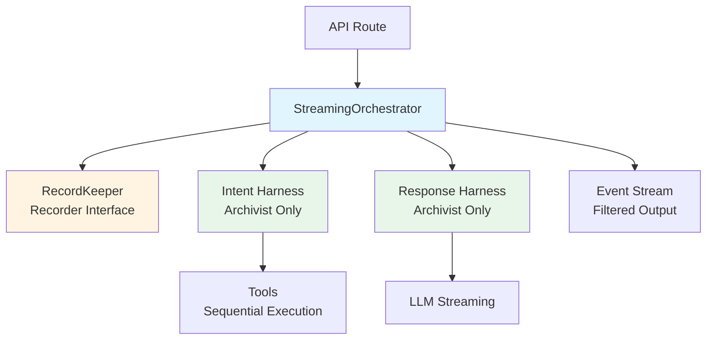

# Intent Harness Refactor with Orchestrator Implementation

## High-Level Overview

This refactor formalizes the streaming event architecture by:

1. **Splitting RecordKeeper responsibilities**: Create `Recorder` (write) and `Archivist` (read) interfaces
2. **Standardizing event types**: Use the event types defined in `bernard/agent/streaming/types.ts`
3. **Implementing StreamingOrchestrator**: Central coordinator that manages conversation state, filters events, and chains harnesses
4. **Refactoring harnesses**: Intent and Response harnesses emit standardized events and only receive `Archivist` for reading

### Architecture Flow



## Technical Deep-Dive

### Part 1: RecordKeeper Interface Split

**Location**: `bernard/lib/conversation/types.ts` (new file)

Create two interfaces that separate read and write operations:

```typescript
import type { BaseMessage } from "@langchain/core/messages";
import type { MessageRecord } from "./types";

/**
 * Archivist interface: Read-only access to conversation data
 * Harnesses receive this interface to retrieve context
 */
export interface Archivist {
  /**
   * Get messages for a conversation, optionally filtered by role
   */
  getMessages(
    conversationId: string,
    options?: {
      limit?: number;
      role?: "user" | "assistant" | "system" | "tool";
      since?: string; // ISO timestamp
    }
  ): Promise<MessageRecord[]>;

  /**
   * Get full conversation with messages
   */
  getFullConversation(conversationId: string): Promise<{
    records: MessageRecord[];
    messages: OpenAIMessage[];
  }>;

  /**
   * Get conversation metadata
   */
  getConversation(conversationId: string): Promise<Conversation | null>;
}

/**
 * Recorder interface: Write-only access to conversation data
 * Orchestrator uses this to record events
 */
export interface Recorder {
  /**
   * Record user or assistant messages
   */
  recordMessage(
    conversationId: string,
    message: BaseMessage | MessageRecord
  ): Promise<void>;

  /**
   * Record LLM call event (start)
   */
  recordLLMCallStart(
    conversationId: string,
    details: {
      messageId: string;
      model: string;
      context: BaseMessage[];
      requestId?: string;
      turnId?: string;
      stage?: string;
    }
  ): Promise<void>;

  /**
   * Record LLM call completion
   */
  recordLLMCallComplete(
    conversationId: string,
    details: {
      messageId: string;
      result: BaseMessage | MessageRecord;
      latencyMs?: number;
      tokens?: { in?: number; out?: number };
    }
  ): Promise<void>;

  /**
   * Record tool call event (start)
   */
  recordToolCallStart(
    conversationId: string,
    details: {
      toolCallId: string;
      toolName: string;
      arguments: string;
      messageId?: string; // Link to AI message that triggered this
    }
  ): Promise<void>;

  /**
   * Record tool call completion
   */
  recordToolCallComplete(
    conversationId: string,
    details: {
      toolCallId: string;
      result: string;
      latencyMs?: number;
    }
  ): Promise<void>;
}
```

**Implementation**: Update `RecordKeeper` class to implement both interfaces internally, but expose them separately:

```typescript
// In RecordKeeper class
export class RecordKeeper implements Archivist, Recorder {
  // ... existing implementation
  
  // Archivist methods (read-only)
  async getMessages(...) { /* existing implementation */ }
  async getFullConversation(...) { /* existing implementation */ }
  async getConversation(...) { /* existing implementation */ }
  
  // Recorder methods (write-only)
  async recordMessage(...) { /* wrap appendMessages */ }
  async recordLLMCallStart(...) { /* new, extract from recordLLMCall */ }
  async recordLLMCallComplete(...) { /* new, extract from recordLLMCall */ }
  async recordToolCallStart(...) { /* new */ }
  async recordToolCallComplete(...) { /* new */ }
  
  // Factory methods to get interface views
  asArchivist(): Archivist { return this; }
  asRecorder(): Recorder { return this; }
}
```

**Langchain vs Manual**:

- **Langchain**: Uses `BaseMessage` types from `@langchain/core/messages`
- **Manual**: Interface design, message ID tracking, Redis storage operations

### Part 2: Event Type Standardization

**Location**: `bernard/agent/streaming/types.ts` (already started)

The event types are already defined. Ensure they match the requirements:

- `LLMCallEvent` - emitted when LLM call starts
- `LLMCallCompleteEvent` - emitted when LLM call completes
- `ToolCallEvent` - emitted when tool call starts
- `ToolCallCompleteEvent` - emitted when tool call completes
- `AIMessageEvent` - **NOT emitted to stream** (used internally only)
- `DeltaEvent` - emitted for streaming text chunks
- `ErrorEvent` - emitted on errors

**Key Change**: Remove `ai_message` from stream output. It's only used internally for RecordKeeper.

### Part 3: Intent Harness Refactor

**Location**: `bernard/agent/harness/intent/intentHarness.ts`

**Current Issues**:

- Emits `ai_message` events (should be internal only)
- Emits `context_update` events (not in standard types)
- Emits `llm_prompt` events (not in standard types)
- Uses RecordKeeper directly (should use Archivist)

**New Flow**:

```typescript
export type IntentHarnessContext = {
  conversationId: string;
  messages: BaseMessage[];
  llmCaller: LLMCaller;
  archivist: Archivist; // Changed from recordKeeper
  haContextManager?: HomeAssistantContextManager;
  abortSignal?: AbortSignal;
};

export async function* runIntentHarness(
  context: IntentHarnessContext
): AsyncGenerator<AgentOutputItem> {
  const { messages, llmCaller, archivist, haContextManager, abortSignal } = context;
  
  // 1. Get conversation history from archivist including tool usages
  const history = await archivist.getMessages(context.conversationId, {
    role: "user" | "assistant" | "tool",
    limit: 20 // configurable
  });
  
  // 2. Build context: system message + history + current messages
  const systemPrompt = buildIntentSystemPrompt(new Date(), toolDefinitions);
  const systemMessage = new SystemMessage(systemPrompt);
  
  let currentMessages: BaseMessage[] = [
    systemMessage,
    ...history.map(msg => messageRecordToBaseMessage(msg)),
    ...messages
  ];
  
  const MAX_TURNS = 5;
  let turnCount = 0;
  
  while (turnCount < MAX_TURNS) {
    turnCount++;
    
    // 3. Emit LLM_CALL event
    const llmCallId = uniqueId("llm_call");
    yield {
      type: "llm_call",
      context: currentMessages
    };
    
    // 4. Call LLM with tools (Langchain handles tool binding)
    let aiMessage: AIMessage;
    try {
      if (llmCaller instanceof ChatOpenAILLMCaller) {
        aiMessage = await llmCaller.completeWithTools(
          currentMessages,
          { model: "intent-router", temperature: 0, maxTokens: 1000, ...(abortSignal ? { abortSignal } : {}) },
          langChainTools
        );
      } else {
        throw new Error("Intent harness requires ChatOpenAILLMCaller");
      }
    } catch (error) {
      yield {
        type: "error",
        error: error instanceof Error ? error.message : String(error)
      };
      throw error;
    }
    
    // 5. Emit LLM_CALL_COMPLETE event
    yield {
      type: "llm_call_complete",
      context: currentMessages,
      result: aiMessage.content || ""
    };
    
    // 6. Extract tool calls (manual code)
    const toolCalls = extractToolCallsFromAIMessage(aiMessage);
    
    // 7. Add AI message to context (manual code)
    currentMessages.push(aiMessage);
    
    // 8. If no tool calls, break
    if (toolCalls.length === 0) {
      break;
    }
    
    // 9. Emit TOOL_CALL events for each tool
    for (const toolCall of toolCalls) {
      yield {
        type: "tool_call",
        toolCall: {
          id: toolCall.id,
          function: {
            name: toolCall.function.name,
            arguments: toolCall.function.arguments
          }
        }
      };
    }
    
    // 10. Execute tools sequentially (manual code, tools are Langchain tools)
    const toolResults: Array<{ toolCallId: string; output: string }> = [];
    for (const toolCall of toolCalls) {
      const tool = langChainTools.find(t => t.name === toolCall.function.name);
      if (!tool) {
        toolResults.push({
          toolCallId: toolCall.id,
          output: `Error: Tool '${toolCall.function.name}' not found`
        });
        continue;
      }
      
      // Parse arguments (manual code)
      let args: Record<string, unknown>;
      try {
        args = JSON.parse(toolCall.function.arguments);
      } catch (error) {
        toolResults.push({
          toolCallId: toolCall.id,
          output: `Error: Invalid tool arguments: ${error}`
        });
        continue;
      }
      
      // Execute tool (Langchain tool.invoke)
      const result = await tool.invoke(args, {
        configurable: { conversationMessages: currentMessages }
      });
      
      toolResults.push({
        toolCallId: toolCall.id,
        output: typeof result === "string" ? result : JSON.stringify(result)
      });
    }
    
    // 11. Emit TOOL_CALL_COMPLETE events
    for (const result of toolResults) {
      yield {
        type: "tool_call_complete",
        toolCall: {
          id: result.toolCallId,
          function: {
            name: toolCalls.find(tc => tc.id === result.toolCallId)?.function.name || "unknown",
            arguments: toolCalls.find(tc => tc.id === result.toolCallId)?.function.arguments || "{}"
          }
        },
        result: result.output
      };
    }
    
    // 12. Add tool messages to context (Langchain ToolMessage)
    const toolMessages = toolResults.map(result =>
      new ToolMessage({
        content: result.output,
        tool_call_id: result.toolCallId,
        name: toolCalls.find(tc => tc.id === result.toolCallId)?.function.name || "unknown"
      })
    );
    currentMessages.push(...toolMessages);
    
    // 13. Check if respond() was called
    if (toolCalls.some(call => call.function.name === "respond")) {
      break;
    }
  }
  
  if (turnCount >= MAX_TURNS) {
    yield {
      type: "error",
      error: "Intent harness reached maximum turn limit"
    };
  }
}
```

**Langchain vs Manual**:

- **Langchain**: `completeWithTools()`, `tool.invoke()`, `AIMessage`, `ToolMessage`, `SystemMessage`
- **Manual**: Event emission, tool call extraction, sequential execution loop, context management

### Part 4: Response Harness Refactor

**Location**: `bernard/agent/harness/respond/responseHarness.ts`

**Current Issues**:

- Uses RecordKeeper directly (should use Archivist)
- Doesn't emit LLM_CALL/LLM_CALL_COMPLETE events
- Records messages itself (should be done by Orchestrator)

**New Flow**:

```typescript
export type ResponseHarnessContext = {
  conversationId: string;
  messages: BaseMessage[];
  llmCaller: LLMCaller;
  archivist: Archivist; // Changed from recordKeeper
  abortSignal?: AbortSignal;
};

export async function* runResponseHarness(
  context: ResponseHarnessContext
): AsyncGenerator<AgentOutputItem> {
  const { messages, llmCaller, archivist, abortSignal } = context;
  
  // 1. Get conversation history
  const history = await archivist.getMessages(context.conversationId, {
    role: "user" | "assistant" | "tool",
    limit: 20
  });
  
  // 2. Build context
  const systemPrompt = buildResponseSystemPrompt();
  const promptMessages: BaseMessage[] = [
    new SystemMessage(systemPrompt),
    ...history.map(msg => messageRecordToBaseMessage(msg)),
    ...messages.filter(msg => msg.type !== "system")
  ];
  
  // 3. Emit LLM_CALL event
  yield {
    type: "llm_call",
    context: promptMessages
  };
  
  // 4. Stream LLM response (Langchain streaming)
  let responseContent = "";
  let finishReason: "stop" | "length" | "content_filter" | undefined;
  const messageId = uniqueId("msg");
  
  try {
    for await (const token of llmCaller.streamText(promptMessages, {
      model: "response-generator",
      temperature: 0.7,
      maxTokens: 1000,
      ...(abortSignal ? { abortSignal } : {})
    })) {
      responseContent += token;
      
      // 5. Emit DELTA event for each token
      yield {
        type: "delta",
        messageId,
        delta: token,
        finishReason: undefined // Will be set on completion
      };
    }
    
    finishReason = "stop";
  } catch (error) {
    if (error instanceof Error && error.name === "AbortError") {
      finishReason = "stop";
    } else {
      yield {
        type: "error",
        error: error instanceof Error ? error.message : String(error)
      };
      finishReason = "stop";
    }
  }
  
  // 6. Emit final DELTA with finish_reason
  yield {
    type: "delta",
    messageId,
    delta: "",
    finishReason
  };
  
  // 7. Emit LLM_CALL_COMPLETE event
  yield {
    type: "llm_call_complete",
    context: promptMessages,
    result: responseContent
  };
  
  // Note: Message recording is done by Orchestrator, not here
}
```

**Langchain vs Manual**:

- **Langchain**: `streamText()`, `SystemMessage`, `BaseMessage` types
- **Manual**: Event emission, delta streaming, message ID tracking

### Part 5: StreamingOrchestrator Implementation

**Location**: `bernard/agent/loop/orchestrator.ts` (new file)

**Responsibilities**:

1. Identify/merge conversations
2. Initialize RecordKeeper with conversation history
3. Chain Intent → Response harnesses
4. Filter events (only DELTA + ERROR, optionally trace events)
5. Record events via Recorder interface
```typescript
import type { Archivist, Recorder } from "@/lib/conversation/types";
import type { RecordKeeper } from "@/lib/conversation/recordKeeper";
import type { AgentOutputItem } from "../streaming/types";
import { runIntentHarness } from "../harness/intent/intentHarness";
import { runResponseHarness } from "../harness/respond/responseHarness";
import type { LLMCaller } from "../llm/llm";
import type { BaseMessage } from "@langchain/core/messages";
import { createDelegateSequencer } from "../streaming/delegateSequencer";

export type OrchestratorInput = {
  conversationId?: string;
  incoming: BaseMessage[]; // User messages
  persistable: BaseMessage[]; // Messages to persist
  requestId?: string;
  turnId?: string;
  trace?: boolean; // Enable trace events
};

export type OrchestratorResult = {
  stream: AsyncIterable<AgentOutputItem>;
  result: Promise<{
    finalMessages: BaseMessage[];
    conversationId: string;
  }>;
};

export class StreamingOrchestrator {
  constructor(
    private recordKeeper: RecordKeeper,
    private intentLLMCaller: LLMCaller,
    private responseLLMCaller: LLMCaller,
    private haContextManager?: HomeAssistantContextManager
  ) {}
  
  async run(input: OrchestratorInput): Promise<OrchestratorResult> {
    const { conversationId: providedId, incoming, persistable, requestId, turnId, trace = false } = input;
    
    // 1. Identify or create conversation
    const { conversationId, isNewConversation, existingHistory } = 
      await this.identifyConversation(providedId, persistable);
    
    // 2. Merge history if needed
    const mergedHistory = isNewConversation 
      ? persistable 
      : await this.mergeHistory(conversationId, persistable, existingHistory);
    
    // 3. Initialize RecordKeeper with conversation
    const recorder = this.recordKeeper.asRecorder();
    const archivist = this.recordKeeper.asArchivist();
    
    // Record incoming messages
    for (const msg of mergedHistory) {
      await recorder.recordMessage(conversationId, msg);
    }
    
    // 4. Create event sequencer
    const sequencer = createDelegateSequencer<AgentOutputItem>();
    
    // 5. Run Intent Harness
    const intentStream = (async function* () {
      const intentHarness = runIntentHarness({
        conversationId,
        messages: mergedHistory,
        llmCaller: this.intentLLMCaller,
        archivist,
        haContextManager: this.haContextManager,
        abortSignal: input.abortSignal
      });
      
      for await (const event of intentHarness) {
        // Record events via Recorder
        await this.recordEvent(recorder, conversationId, event, requestId, turnId);
        
        // Yield filtered events
        if (this.shouldEmitEvent(event, trace)) {
          yield event;
        }
      }
    }).bind(this)();
    
    sequencer.chain(intentStream);
    
    // 6. Run Response Harness (after intent completes)
    const responseStream = (async function* () {
      // Get final context from intent harness
      const finalContext = await this.getFinalContext(archivist, conversationId);
      
      const responseHarness = runResponseHarness({
        conversationId,
        messages: finalContext,
        llmCaller: this.responseLLMCaller,
        archivist,
        abortSignal: input.abortSignal
      });
      
      for await (const event of responseHarness) {
        // Record events via Recorder
        await this.recordEvent(recorder, conversationId, event, requestId, turnId);
        
        // Yield filtered events
        if (this.shouldEmitEvent(event, trace)) {
          yield event;
        }
      }
    }).bind(this)();
    
    sequencer.chain(responseStream);
    sequencer.done();
    
    // 7. Build result promise
    let resolveResult: (value: { finalMessages: BaseMessage[]; conversationId: string }) => void;
    const resultPromise = new Promise<{ finalMessages: BaseMessage[]; conversationId: string }>((resolve) => {
      resolveResult = resolve;
    });
    
    // Collect final messages as stream processes
    const finalMessages: BaseMessage[] = [];
    const outputStream = (async function* () {
      for await (const event of sequencer.sequence) {
        // Track messages for final result
        if (event.type === "delta") {
          // Accumulate deltas into final message
          // (implementation details)
        }
        
        yield event;
      }
      
      // Resolve with final messages
      resolveResult({
        finalMessages,
        conversationId
      });
    })();
    
    return {
      stream: outputStream,
      result: resultPromise
    };
  }
  
  private async identifyConversation(
    providedId: string | undefined,
    persistable: BaseMessage[]
  ): Promise<{
    conversationId: string;
    isNewConversation: boolean;
    existingHistory?: MessageRecord[];
  }> {
    if (providedId) {
      const existing = await this.recordKeeper.getConversation(providedId);
      if (existing) {
        const history = await this.recordKeeper.getMessages(providedId);
        return {
          conversationId: providedId,
          isNewConversation: false,
          existingHistory: history
        };
      }
    }
    
    // Create new conversation
    const newId = uniqueId("conv");
    return {
      conversationId: newId,
      isNewConversation: true
    };
  }
  
  private async mergeHistory(
    conversationId: string,
    newMessages: BaseMessage[],
    existingHistory: MessageRecord[]
  ): Promise<BaseMessage[]> {
    // Identify which messages are new vs existing
    // This is a simplified version - actual implementation would need
    // to compare message content/timestamps to detect duplicates
    const existingMessageIds = new Set(existingHistory.map(m => m.id));
    const newUniqueMessages = newMessages.filter(msg => {
      // Check if message already exists (simplified)
      return true; // For now, assume all are new
    });
    
    return [
      ...existingHistory.map(msg => messageRecordToBaseMessage(msg)),
      ...newUniqueMessages
    ];
  }
  
  private async recordEvent(
    recorder: Recorder,
    conversationId: string,
    event: AgentOutputItem,
    requestId?: string,
    turnId?: string
  ): Promise<void> {
    switch (event.type) {
      case "llm_call":
        await recorder.recordLLMCallStart(conversationId, {
          messageId: uniqueId("msg"),
          model: "intent-router", // or from context
          context: event.context,
          requestId,
          turnId,
          stage: "intent"
        });
        break;
        
      case "llm_call_complete":
        // Link to previous LLM_CALL via messageId tracking
        await recorder.recordLLMCallComplete(conversationId, {
          messageId: this.getCurrentMessageId(), // Tracked internally
          result: new AIMessage({ content: event.result }),
          // latencyMs, tokens would come from LLM response
        });
        break;
        
      case "tool_call":
        await recorder.recordToolCallStart(conversationId, {
          toolCallId: event.toolCall.id,
          toolName: event.toolCall.function.name,
          arguments: event.toolCall.function.arguments,
          messageId: this.getCurrentMessageId()
        });
        break;
        
      case "tool_call_complete":
        await recorder.recordToolCallComplete(conversationId, {
          toolCallId: event.toolCall.id,
          result: event.result
          // latencyMs would be tracked internally
        });
        break;
        
      case "delta":
        // Accumulate deltas into message
        // Record when finishReason is set
        if (event.finishReason) {
          await recorder.recordMessage(conversationId, new AIMessage({
            content: this.getAccumulatedContent(event.messageId),
            id: event.messageId
          }));
        }
        break;
    }
  }
  
  private shouldEmitEvent(event: AgentOutputItem, trace: boolean): boolean {
    // Always emit DELTA and ERROR
    if (event.type === "delta" || event.type === "error") {
      return true;
    }
    
    // Emit trace events if trace=true
    if (trace) {
      return event.type === "llm_call" ||
             event.type === "llm_call_complete" ||
             event.type === "tool_call" ||
             event.type === "tool_call_complete";
    }
    
    // Don't emit AI_MESSAGE or other internal events
    return false;
  }
  
  private async getFinalContext(
    archivist: Archivist,
    conversationId: string
  ): Promise<BaseMessage[]> {
    // Get all messages including tool calls/results from intent harness
    const records = await archivist.getMessages(conversationId);
    return records.map(msg => messageRecordToBaseMessage(msg));
  }
}
```


**Langchain vs Manual**:

- **Langchain**: `BaseMessage`, `AIMessage` types
- **Manual**: Event filtering, conversation management, history merging, message ID tracking, event recording

### Part 6: API Route Integration

**Location**: `bernard/app/api/v1/chat/completions/route.ts`

Update to use StreamingOrchestrator:

```typescript
import { StreamingOrchestrator } from "@/agent/loop/orchestrator";
import { delegateStreamFromAsyncGenerator } from "@/agent/streaming/delegateSequencer";
import { createSSEStream } from "@/agent/streaming/sse";

export async function POST(request: NextRequest) {
  // ... existing request parsing ...
  
  const orchestrator = new StreamingOrchestrator(
    recordKeeper,
    intentLLMCaller,
    responseLLMCaller,
    haContextManager
  );
  
  const { stream, result } = await orchestrator.run({
    conversationId: body.conversationId,
    incoming: messages,
    persistable: messages,
    requestId,
    turnId,
    trace: body.stream_options?.trace === true
  });
  
  // Convert AgentOutputItems to StreamingChunks
  const streamingChunks = (async function* () {
    // ... existing chunk conversion logic ...
    for await (const event of stream) {
      // Convert to OpenAI-compatible chunks
      // ... existing logic ...
    }
  })();
  
  const readableStream = delegateStreamFromAsyncGenerator(streamingChunks);
  const sseStream = createSSEStream(readableStream);
  
  return new NextResponse(sseStream, {
    headers: {
      "Content-Type": "text/event-stream",
      "Cache-Control": "no-cache",
      "Connection": "keep-alive"
    }
  });
}
```

## Implementation Summary

### Langchain Responsibilities

- **Message Types**: `BaseMessage`, `AIMessage`, `ToolMessage`, `SystemMessage`, `HumanMessage`
- **Tool Execution**: `StructuredToolInterface.invoke()`, `bindTools()`
- **LLM Calls**: `ChatOpenAILLMCaller.completeWithTools()`, `streamText()`
- **Streaming**: Langchain's native streaming via `client.stream()`

### Manual Code Responsibilities

- **Event Emission**: All `AgentOutputItem` events (LLM_CALL, TOOL_CALL, DELTA, etc.)
- **Event Filtering**: Orchestrator's `shouldEmitEvent()` logic
- **Conversation Management**: Identification, merging, history tracking
- **Sequential Tool Execution**: Loop that executes tools one-by-one
- **Message ID Tracking**: Linking events to messages for RecordKeeper
- **Context Building**: Assembling system prompts + history + current messages
- **Stream Coordination**: DelegateSequencer chaining of harness streams

## Migration Path

1. **Phase 1**: Create interfaces and update RecordKeeper (non-breaking)
2. **Phase 2**: Refactor Intent Harness to use Archivist and emit standard events
3. **Phase 3**: Refactor Response Harness to use Archivist and emit standard events
4. **Phase 4**: Implement StreamingOrchestrator
5. **Phase 5**: Update API route to use Orchestrator
6. **Phase 6**: Remove old `chatCompletionsTurn.ts` logic

## Testing Strategy

- **Unit Tests**: Each harness emits correct events
- **Integration Tests**: Orchestrator chains harnesses correctly
- **Event Filtering Tests**: Only DELTA/ERROR emitted (plus trace when enabled)
- **RecordKeeper Tests**: Events recorded correctly via Recorder interface
- **End-to-End Tests**: Full flow from API → Orchestrator → Harnesses → Stream