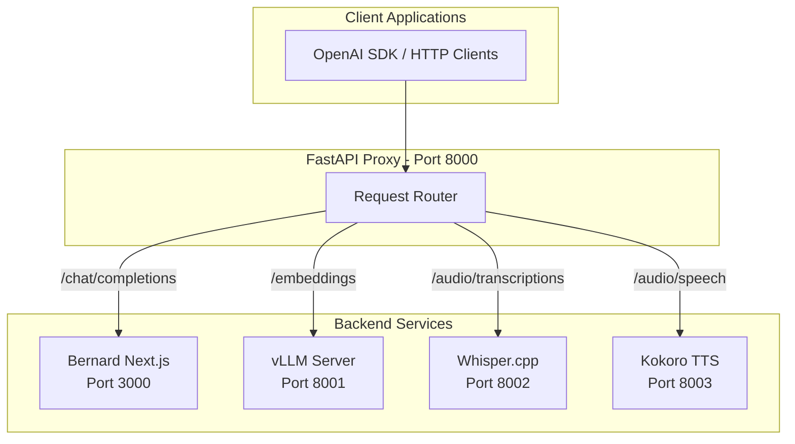

# OpenAI-Compatible Proxy Integration Plan

## Architecture Overview




## Directory Structure

```javascript
bernard/
├── api/                          # NEW: FastAPI proxy service
│   ├── venv/                     # Python virtual environment
│   ├── main.py                   # FastAPI proxy router
│   ├── services/
│   │   ├── __init__.py
│   │   ├── whisper_server.py     # Whisper.cpp wrapper
│   │   └── config.py             # Service configuration
│   ├── requirements.txt          # Python dependencies
│   ├── install.sh                # Installation script
│   └── start.sh                  # Startup script
├── models/
│   ├── whisper/                  # NEW: Whisper models
│   │   └── ggml-small.bin
│   ├── kokoro/                   # NEW: Kokoro models (auto-downloaded)
│   └── llama-server/             # Existing GGUF models
└── bernard/                      # Existing Next.js app (unchanged core)
```


## Phase 1: Create FastAPI Proxy Infrastructure

### 1.1 Create Proxy Directory and Configuration

Create [`api/`](api/) directory with:

- [`api/requirements.txt`](api/requirements.txt) - Python dependencies:
- `fastapi`, `uvicorn[standard]`, `httpx`, `pydantic`, `python-multipart`
- For Whisper wrapper: `aiofiles`
- [`api/services/config.py`](api/services/config.py) - Service URLs and configuration:
  ```python
      BERNARD_URL = "http://localhost:3000"  # Next.js
      VLLM_URL = "http://localhost:8001"     # Embeddings
      WHISPER_URL = "http://localhost:8002"  # STT
      KOKORO_URL = "http://localhost:8003"   # TTS
  ```


### 1.2 Create Main FastAPI Router

Create [`api/main.py`](api/main.py) with routes:

- `POST /v1/chat/completions` - Proxy to Bernard (port 3000)
- `POST /v1/embeddings` - Proxy to vLLM (port 8001)
- `POST /v1/audio/transcriptions` - Proxy to Whisper (port 8002)
- `POST /v1/audio/speech` - Proxy to Kokoro (port 8003)
- `GET /v1/models` - Aggregate models from all backends
- `GET /health` - Health check all services

Key implementation details:

- Stream SSE responses from Bernard for chat completions
- Forward multipart form data for audio transcriptions
- Return binary audio streams for TTS
- Proper error handling and timeouts (300s for inference)

### 1.3 Create Whisper.cpp FastAPI Wrapper

Create [`api/services/whisper_server.py`](api/services/whisper_server.py):

- Wraps whisper.cpp binary with OpenAI-compatible API
- Handles audio file upload, temp file management
- Returns JSON transcription response
- Runs on port 8002

## Phase 2: Installation Script

Create [`api/install.sh`](api/install.sh) that performs:

### 2.1 Python Environment Setup

```bash
python3 -m venv api/venv
source api/venv/bin/activate
pip install -r api/requirements.txt
```


### 2.2 vLLM Installation

```bash
pip install vllm transformers torch
# Pre-download nomic-embed-text-v1.5 model
python -c "from transformers import AutoModel; AutoModel.from_pretrained('nomic-ai/nomic-embed-text-v1.5', trust_remote_code=True)"
```


### 2.3 Whisper.cpp Build

```bash
cd function-gemma/llama.cpp  # Use existing llama.cpp build infrastructure
# Or clone whisper.cpp separately and build with CUDA
git clone https://github.com/ggerganov/whisper.cpp api/whisper.cpp
cd api/whisper.cpp && mkdir build && cd build
cmake .. -DGGML_CUDA=ON && make -j$(nproc)
# Download whisper model
bash models/download-ggml-model.sh small
```


### 2.4 Kokoro TTS Setup

```bash
git clone https://github.com/remsky/Kokoro-FastAPI api/kokoro
cd api/kokoro && pip install -e .
```


## Phase 3: Startup Script

Create [`api/start.sh`](api/start.sh) that:

### 3.1 Starts Backend Services (in order)

1. **vLLM** (port 8001) - Embeddings with nomic-embed-text-v1.5
2. **Whisper** (port 8002) - STT via whisper_server.py wrapper
3. **Kokoro** (port 8880) - TTS server
4. **FastAPI Proxy** (port 8000) - Main router

### 3.2 Process Management

- Background all services with PID tracking
- Health check each service before starting next
- Trap SIGINT/SIGTERM for graceful shutdown
- Log output to `logs/` directory

## Phase 4: Update Existing Bernard Code

### 4.1 Remove Stub Endpoints

Delete or simplify these Next.js routes (they become proxied):

- [`bernard/app/api/v1/embeddings/route.ts`](bernard/app/api/v1/embeddings/route.ts) - Currently returns 501
- [`bernard/app/api/v1/moderations/route.ts`](bernard/app/api/v1/moderations/route.ts) - Currently returns 501

These can remain as-is since the proxy handles routing, but we should remove the 501 stubs to avoid confusion.

### 4.2 Update Embeddings Configuration

Modify [`bernard/lib/config/embeddings.ts`](bernard/lib/config/embeddings.ts):

- Default `baseUrl` to `http://localhost:8001/v1` (vLLM)
- Default model to `nomic-ai/nomic-embed-text-v1.5`
- Remove Ollama fallback logic (clean break)

### 4.3 Update Environment Configuration

Update [`bernard/env.example`](bernard/env.example):

```bash
# AI Services Proxy
PROXY_PORT=8000
VLLM_PORT=8001
WHISPER_PORT=8002
KOKORO_PORT=8003

# Embedding configuration (now via vLLM)
EMBEDDING_BASE_URL=http://localhost:8001/v1
EMBEDDING_MODEL=nomic-ai/nomic-embed-text-v1.5
```


## Phase 5: Integration with start-all.sh

Update [`start-all.sh`](start-all.sh) to:

1. Start AI services first via `api/start.sh`
2. Wait for proxy health check
3. Then start Bernard, UI, and workers as before
4. Update cleanup to stop AI services

## File Changes Summary

| File | Action | Description ||------|--------|-------------|| `api/` | CREATE | New FastAPI proxy directory || `api/main.py` | CREATE | Main proxy router || `api/services/whisper_server.py` | CREATE | Whisper.cpp wrapper || `api/services/config.py` | CREATE | Service configuration || `api/requirements.txt` | CREATE | Python dependencies || `api/install.sh` | CREATE | Installation script || `api/start.sh` | CREATE | Startup script || `bernard/lib/config/embeddings.ts` | MODIFY | Update defaults for vLLM || `bernard/env.example` | MODIFY | Add proxy configuration || `start-all.sh` | MODIFY | Integrate AI services startup || `bernard/app/api/v1/embeddings/route.ts` | DELETE | Remove stub (proxied now) || `bernard/app/api/v1/moderations/route.ts` | DELETE | Remove stub (not needed) |

## Port Allocation

| Port | Service | Purpose ||------|---------|---------|| 3000 | Bernard (Next.js) | Chat completions, existing API || 4200 | Bernard UI | Admin interface || 8000 | FastAPI Proxy | Main OpenAI-compatible entry point || 8001 | vLLM | Embeddings (nomic-embed-text-v1.5) || 8002 | Whisper.cpp | Speech-to-text || 8003 | Kokoro | Text-to-speech |

## Testing Strategy

After implementation:

1. `curl http://localhost:8000/health` - All services healthy
2. `curl http://localhost:8000/v1/models` - Lists all available models
3. Test embeddings: `curl -X POST http://localhost:8000/v1/embeddings -d '{"model":"nomic-ai/nomic-embed-text-v1.5","input":"test"}'`