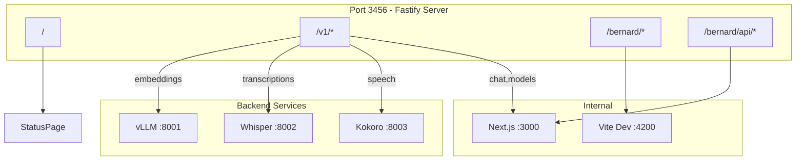

# Unified Bernard Server Architecture

## Current State

You have 5+ processes running on different ports:

- **Port 3000**: Next.js (bernard API)
- **Port 4200**: Vite (bernard-ui React app)
- **Port 8000**: Python FastAPI proxy
- **Port 8001**: vLLM embeddings
- **Port 8002**: Whisper.cpp wrapper (Python)
- **Port 8003**: Kokoro TTS

The Python proxy ([`api/main.py`](api/main.py)) is just forwarding requests - easily replaceable.

## New Architecture

Single Fastify server on **port 3456** that:




## Route Structure

| Route | Handler ||-------|---------|| `/` | Status/index page with service health, uptime, links || `/v1/models` | Aggregate from Next.js + static audio models || `/v1/chat/completions` | Proxy to Next.js `:3000/api/v1/chat/completions` || `/v1/completions` | Proxy to Next.js || `/v1/embeddings` | Proxy to vLLM `:8001/v1/embeddings` || `/v1/audio/transcriptions` | Proxy to Whisper `:8002` || `/v1/audio/speech` | Proxy to Kokoro `:8003` || `/bernard/*` | Proxy to Vite dev server `:4200` || `/bernard/api/*` | Proxy to Next.js `:3000/api/*` |

## Implementation

### 1. New Fastify Server (`server/`)

Create a new `server/` directory at project root:

```javascript
server/
├── package.json
├── tsconfig.json
├── src/
│   ├── index.ts          # Entry point
│   ├── routes/
│   │   ├── index.ts      # Status page
│   │   ├── v1.ts         # OpenAI-compatible routes
│   │   └── bernard.ts    # UI proxy
│   ├── proxy/
│   │   └── handlers.ts   # Proxy logic for each backend
│   └── lib/
│       ├── health.ts     # Health check utilities
│       └── logger.ts     # Colorized, labeled logging
```

Key dependencies:

- `fastify` - Core framework
- `@fastify/http-proxy` - Proxy plugin
- `@fastify/static` - Serve static files
- `@fastify/cors` - CORS handling
- `pino-pretty` - Readable colored logs

### 2. Whisper Server Rewrite

Replace [`api/services/whisper_server.py`](api/services/whisper_server.py) with TypeScript in `server/src/services/whisper.ts`:

- Same subprocess call to whisper.cpp binary
- Fastify multipart handling for audio uploads
- OpenAI-compatible `/v1/audio/transcriptions` response format

### 3. Unified `start.sh`

New [`start.sh`](start.sh) at project root:

```bash
#!/usr/bin/env bash
# Phase 1: Build checks (fail fast)
# - tsc --noEmit
# - eslint
# - next build

# Phase 2: Start backend services (background)
# - vLLM (embeddings)
# - Kokoro TTS
# - Whisper (now TypeScript, part of unified server)

# Phase 3: Start application servers
# - Next.js dev server (:3000)
# - Vite dev server (:4200)
# - Fastify unified server (:3456)

# Logging:
# - Prefixed with [VLLM], [KOKORO], [NEXT], [VITE], [SERVER]
# - Colored by service
# - Timestamps
# - Errors in red, warnings in yellow
```


### 4. Index Status Page

Serve at `/` with:

- Service health status (up/down/starting)
- Uptime counters
- Quick links: `/bernard/admin`, `/bernard/chat`, `/v1/models`
- Last error per service
- Simple HTML (no React, fast load)

## Files to Create

| File | Purpose ||------|---------|| `server/package.json` | Fastify server dependencies || `server/tsconfig.json` | TypeScript config || `server/src/index.ts` | Server entry point || `server/src/routes/index.ts` | Status page route || `server/src/routes/v1.ts` | OpenAI-compatible proxy routes || `server/src/routes/bernard.ts` | UI and API proxy || `server/src/proxy/handlers.ts` | Proxy utilities || `server/src/lib/logger.ts` | Colorized logging || `server/src/lib/health.ts` | Health check logic || `start.sh` | Unified dev script (replaces `start-all.sh`) |

## Files to Delete

| File | Reason ||------|--------|| `api/main.py` | Replaced by Fastify server || `api/services/whisper_server.py` | Integrated into Fastify || `api/services/config.py` | Config moves to TypeScript || `api/start.sh` | Merged into unified `start.sh` || `start-all.sh` | Replaced by new `start.sh` |

## Migration Notes

- Keep `api/kokoro/` and `api/whisper.cpp/` - these are the actual model servers
- Keep `api/vllm_venv/` - vLLM still runs as Python process
- The Python files in `api/services/` are just wrappers - those get replaced
- Next.js stays on port 3000 internally (not exposed directly)