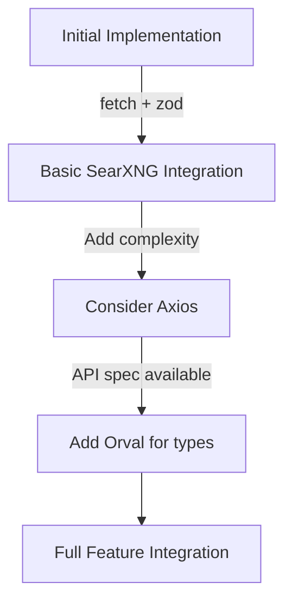

# SearXNG Integration Libraries Documentation

This document identifies and documents the TypeScript libraries needed for SearXNG integration based on research findings and current codebase analysis.

## Current Implementation Analysis

The existing web search implementation in [`web-search.ts`](bernard/agent/harness/intent/tools/web-search.ts) uses:
- Native `fetch` API for HTTP requests (line 169)
- `zod` for validation (already in package.json)
- Environment-based configuration

## Recommended Libraries for SearXNG Integration

### 1. HTTP Client Libraries

#### Option A: Continue with Native Fetch API
```typescript
// Current approach - no additional library needed
fetch(url, { headers: { Authorization: `Bearer ${apiKey}` } })
```

**Rationale:** 
- ✅ Already used in current implementation
- ✅ No additional dependency required
- ✅ Modern, built-in browser/Node.js API
- ✅ Good for simple GET/POST requests
- ❌ Limited advanced features (retries, interceptors, etc.)

#### Option B: Axios
```typescript
import axios from 'axios';
axios.get(url, { headers: { Authorization: `Bearer ${apiKey}` } })
```

**Rationale:**
- ✅ Rich feature set (interceptors, request/response transforms)
- ✅ Automatic JSON parsing
- ✅ Better error handling
- ✅ Request cancellation support
- ✅ Timeouts and retry mechanisms
- ❌ Additional dependency (~40KB)

#### Option C: Got
```typescript
import got from 'got';
got(url, { headers: { Authorization: `Bearer ${apiKey}` } })
```

**Rationale:**
- ✅ Promise-based API
- ✅ Retry mechanism built-in
- ✅ Follow redirects automatically
- ✅ Good for scraping/meta-search scenarios
- ❌ Additional dependency

**Recommendation:** Continue with native `fetch` API for consistency with existing codebase, but consider Axios if advanced features like retries or interceptors are needed for SearXNG API calls.

### 2. TypeScript Type Generation Tools

#### Option A: Orval
```typescript
// Generate types from SearXNG API specification
orval config.yaml
```

**Rationale:**
- ✅ Generates TypeScript types from OpenAPI/Swagger specs
- ✅ Supports multiple output formats
- ✅ Can generate API clients alongside types
- ✅ Configurable via YAML
- ❌ Requires OpenAPI spec availability

#### Option B: Swagger-to-TypeScript
```typescript
// Generate types from Swagger/OpenAPI
swagger-to-ts -i searxng-api.yaml -o src/types/searxng.ts
```

**Rationale:**
- ✅ Simple CLI tool
- ✅ Focused on type generation
- ✅ Good for REST APIs
- ❌ Less flexible than Orval

#### Option C: Manual Type Definition
```typescript
// Manual type definitions based on SearXNG API documentation
type SearXNGResult = {
  title: string;
  url: string;
  content: string;
  engine: string;
  score?: number;
};
```

**Rationale:**
- ✅ No build-time dependency
- ✅ Full control over types
- ✅ No tooling complexity
- ❌ Manual maintenance required
- ❌ Risk of API/type mismatch

**Recommendation:** Use manual type definitions initially since SearXNG doesn't have a formal OpenAPI spec. If integration grows complex, consider Orval for automated type generation.

### 3. Validation Libraries

#### Current: Zod (Already Used)
```typescript
import { z } from 'zod';

const searxngResultSchema = z.object({
  title: z.string(),
  url: z.string().url(),
  content: z.string().optional(),
  engine: z.string(),
  score: z.number().optional()
});
```

**Rationale:**
- ✅ Already in package.json (v4.1.13)
- ✅ TypeScript-first schema validation
- ✅ Excellent error messages
- ✅ Schema-based type inference
- ✅ Composable schemas
- ✅ Used throughout existing codebase

**Recommendation:** Continue using Zod for SearXNG response validation to maintain consistency.

### 4. Additional Relevant Libraries

#### Query String Parsing: qs
```typescript
import qs from 'qs';
const queryParams = qs.stringify({ q: searchQuery, format: 'json' });
```

**Rationale:**
- ✅ Better query string handling than native URLSearchParams
- ✅ Supports nested objects
- ✅ Configurable serialization
- ❌ Additional dependency

#### Environment Configuration: dotenv
```typescript
// Already handled by Next.js, but for reference:
import 'dotenv/config';
```

**Rationale:**
- ✅ Already handled by Next.js
- ✅ No additional library needed

#### Logging: pino (Already Used)
```typescript
import logger from '@/lib/logging';
logger.info('SearXNG request: %s', query);
```

**Rationale:**
- ✅ Already in package.json
- ✅ Consistent with existing logging

## Comprehensive Library List with Rationale

### Core Libraries

| Library | Purpose | Status | Rationale |
|---------|---------|--------|-----------|
| `fetch` (native) | HTTP client | ✅ Use | Already used, no dependency, sufficient for basic needs |
| `zod` | Validation | ✅ Already installed | Consistent with existing validation approach |
| `pino` | Logging | ✅ Already installed | Consistent with existing logging |

### Optional Enhancements

| Library | Purpose | Status | Rationale |
|---------|---------|--------|-----------|
| `axios` | Advanced HTTP client | ⚠️ Consider | If retries, interceptors, or better error handling needed |
| `got` | HTTP client | ❌ Skip | Overkill for current needs |
| `orval` | Type generation | ⚠️ Future | If SearXNG provides OpenAPI spec |
| `swagger-to-typescript` | Type generation | ❌ Skip | Less flexible than Orval |
| `qs` | Query parsing | ⚠️ Consider | If complex query parameters needed |

### Configuration Approach

Based on existing patterns in [`web-search.ts`](bernard/agent/harness/intent/tools/web-search.ts):

```typescript
// Environment variables (via Next.js)
const SEARXNG_API_URL = process.env.SEARXNG_API_URL || 'https://searxng.example.com/search';
const SEARXNG_API_KEY = process.env.SEARXNG_API_KEY;

// Settings fallback (from Redis)
async function getSearXNGConfig() {
  const settings = await getSettings();
  return settings?.services?.searxng;
}
```

### Error Handling Strategy

```typescript
// Consistent with existing error handling
try {
  const response = await fetch(url, { headers });
  if (!response.ok) {
    throw new Error(`SearXNG error: ${response.status} ${response.statusText}`);
  }
  const data = await response.json();
  return searxngResultSchema.parse(data); // Zod validation
} catch (error) {
  logger.error('SearXNG request failed: %s', error.message);
  throw new Error('Search failed, please try again later');
}
```

## Implementation Recommendations

1. **Start Simple**: Use native `fetch` + `zod` for initial implementation
2. **Add Axios Later**: If you need retries, timeouts, or interceptors
3. **Manual Types First**: Define SearXNG response types manually
4. **Consider Orval**: If SearXNG API becomes complex or provides OpenAPI spec
5. **Reuse Existing Patterns**: Follow the same configuration and error handling as web-search

## Migration Path



This approach ensures minimal dependencies while allowing for future enhancements as the SearXNG integration matures.