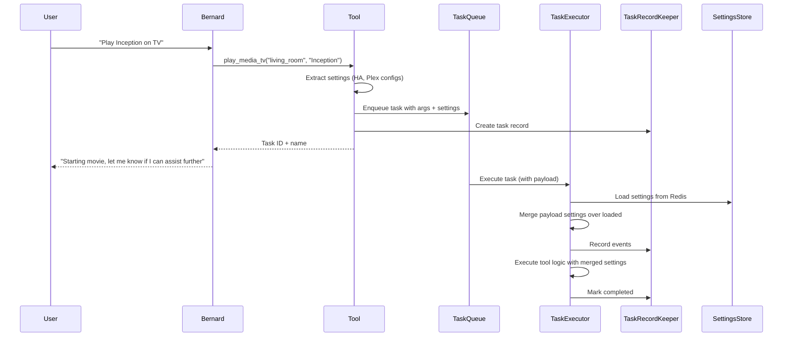

# Background Task System Design

## Overview

A background task system that allows bernard to spawn long-running tasks (like `play_media_tv`) that execute asynchronously while bernard immediately responds to the user. Tasks are tracked separately from conversations, have their own RecordKeeper-like storage, and are visible in the user UI.

## Architecture

### Core Components

1. **TaskRecordKeeper** (`bernard/lib/task/recordKeeper.ts`)
   - Similar to `RecordKeeper` but for tasks
   - Stores task metadata, execution logs, messages, tool calls
   - Uses Redis with namespace `bernard:task:rk`
   - Tracks: runtime, tool call count, message count, token counts, status (running/completed/errored/timed_out)

2. **Task Executor** (`bernard/lib/task/executor.ts`)
   - Simple executor that runs task functions
   - Can optionally use LLM if task requires it
   - Records execution events to TaskRecordKeeper
   - Handles timeouts and errors
   - **CRITICAL**: Loads settings from Redis/DB in worker process, but also accepts settings in payload as override/fallback

3. **Task Queue** (`bernard/lib/task/queue.ts`)
   - Uses BullMQ (like automations queue)
   - Queue name: `background-tasks`
   - Processes tasks asynchronously
   - Worker runs in separate process (`bernard/agent/taskWorkerMain.ts`)

4. **Task Types** (`bernard/lib/task/types.ts`)
   - Task definition, status, metadata types
   - Task sections (for recall_task tool)
   - Task execution context
   - **TaskPayload** includes:
     - `toolName`: string - Name of tool that created the task
     - `arguments`: Record<string, unknown> - Serialized tool arguments
     - `settings`: Partial<BernardSettings> - Service configs needed (HA, Plex, etc.)
     - `userId`: string - User who initiated the task
     - `conversationId`?: string - Optional conversation context
     - `maxTokens`?: number - Token limit for task (if applicable)
     - `sections`?: Record<string, string> - Task-specific sections metadata

### Tool Integration

5. **Task Generation in Tools**
   - Tools can mark themselves as "background tasks"
   - `play_media_tv` will be modified to generate a task instead of executing directly
   - Tool returns task ID and name immediately
   - Task name auto-generated: `{toolName}: {param1} ({param2})` e.g., `play_media_tv: Inception (living_room)`
   - **CRITICAL**: When creating task, tool must:
     - Serialize all arguments properly (handle functions, complex objects)
     - Extract and pass required settings (HA config, Plex config) from current context
     - Pass userId from conversation context

6. **recall_task Tool** (`bernard/agent/harness/router/tools/recall_task.tool.ts`)
   - Allows bernard to query task state
   - Parameters: `id`, `offset?`, `count?`, `section?`
   - Returns task metadata and optionally messages/logs
   - Sections vary by task type (e.g., research tasks might have "summary", "references")

### API Layer

7. **Task API Endpoints** (`bernard/app/api/tasks/`)
   - `GET /api/tasks` - List user's tasks (with archived filter)
   - `GET /api/tasks/[id]` - Get task details with full execution log
   - `POST /api/tasks/create` - Create task (internal, called by tools)

### UI Layer

8. **Task List Page** (`bernard-ui/src/pages/Tasks.tsx`)
   - User-facing page (not admin)
   - Shows: task name, status, runtime, tool calls, messages, tokens, created date
   - Filter: show archived (completed >7 days)
   - Links to task detail page

9. **Task Detail Page** (`bernard-ui/src/pages/TaskDetail.tsx`)
   - Shows full execution log (like conversation history)
   - Sidebar with metadata (runtime, tool calls, tokens, status)
   - Similar to `ConversationDetail.tsx` but for tasks

10. **Navigation Update**
    - Add "Tasks" link to `UserLayout` navigation
    - Route: `/tasks` and `/tasks/:id`

### Task Lifecycle

11. **Task Archiving** (`bernard/lib/task/archiver.ts`)
    - Background job that archives completed tasks after 7 days
    - Sets `archived: true` flag
    - Tasks remain queryable but hidden by default in UI

## Implementation Details

### Settings and Arguments Handling

**CRITICAL**: Tasks run in a separate worker process that may not have access to the same settings cache or context. Therefore:

1. **Task Payload Must Include Settings**:
   - When a tool creates a task, it must extract and serialize required settings
   - For `play_media_tv`: Include `haRestConfig` and `plexConfig` in payload
   - Settings are stored as `Partial<BernardSettings>` in task payload
   - Worker process uses these settings as primary source, falls back to loading from Redis/DB if missing

2. **Arguments Serialization**:
   - All tool arguments must be JSON-serializable
   - Functions, complex objects, or non-serializable data must be handled
   - Task executor reconstructs tool context from serialized arguments
   - For `play_media_tv`: Arguments are simple (location_id, media_query, playback_mode) - all serializable

3. **Worker Process Settings Loading**:
   - Worker process calls `getSettings()` to load full settings from Redis/DB
   - Merges payload settings over loaded settings (payload takes precedence)
   - This ensures worker has all necessary configs even if payload is incomplete

### Task Storage Structure

Tasks stored in Redis similar to conversations:
- `bernard:task:rk:task:{taskId}` - Task metadata hash
- `bernard:task:rk:task:{taskId}:msgs` - Task message log (list)
- `bernard:task:rk:tasks:active` - Sorted set of active tasks
- `bernard:task:rk:tasks:completed` - Sorted set of completed tasks
- `bernard:task:rk:tasks:archived` - Sorted set of archived tasks

### Task Execution Flow



### play_media_tv Modification

The tool will:
1. Generate unique task ID
2. Extract current settings (HA config, Plex config) from orchestrator context
3. Serialize tool arguments (location_id, media_query, playback_mode)
4. Create task record in TaskRecordKeeper with userId from conversation
5. Enqueue task to background queue with:
   - `toolName: "play_media_tv"`
   - `arguments: { location_id, media_query, playback_mode }`
   - `settings: { services: { homeAssistant: {...}, plex: {...} } }`
   - `userId: <from conversation>`
6. Return immediately with task ID and auto-generated name
7. Task executes asynchronously in worker, recording all steps

### Task Sections

Tasks can define sections for structured recall:
- Default sections: `execution_log`, `metadata`
- Tool-specific sections (e.g., research tool): `summary`, `references`, `reference1`, etc.
- Sections described in tool metadata

## File Structure

```
bernard/
  lib/
    task/
      recordKeeper.ts          # TaskRecordKeeper class
      executor.ts               # Task executor (loads settings, merges with payload)
      queue.ts                   # BullMQ queue setup
      types.ts                   # Task type definitions (includes TaskPayload with settings)
      archiver.ts                # Archiving logic
  agent/
    harness/
      router/
        tools/
          recall_task.tool.ts   # recall_task tool
    taskWorkerMain.ts           # Task queue worker (loads env, starts worker)
  app/
    api/
      tasks/
        route.ts                 # GET /api/tasks (list)
        [id]/
          route.ts               # GET /api/tasks/[id] (detail)
        create/
          route.ts               # POST /api/tasks/create (internal)

bernard-ui/
  src/
    pages/
      Tasks.tsx                 # Task list page
      TaskDetail.tsx            # Task detail page
    services/
      api.ts                    # Add task API methods
```

## Migration Path

1. Create TaskRecordKeeper and types (with TaskPayload including settings)
2. Create task queue and executor (with settings loading/merging)
3. Create recall_task tool
4. Modify play_media_tv to generate tasks (extract and pass settings)
5. Create API endpoints
6. Create UI pages
7. Add archiving job
8. Update navigation

## Configuration

- `TASK_QUEUE_NAME` - Queue name (default: "background-tasks")
- `TASK_MAX_RUNTIME_MS` - Max task runtime before timeout (default: 1 hour)
- `TASK_ARCHIVE_AFTER_DAYS` - Days before archiving (default: 7)
- `TASK_WORKER_CONCURRENCY` - Worker concurrency (default: 3)

## Key Implementation Notes

### Settings Passing Pattern

```typescript
// In tool (play_media_tv):
const taskPayload: TaskPayload = {
  toolName: "play_media_tv",
  arguments: {
    location_id,
    media_query,
    playback_mode
  },
  settings: {
    services: {
      homeAssistant: haRestConfig ? {
        baseUrl: haRestConfig.baseUrl,
        accessToken: haRestConfig.accessToken
      } : undefined,
      plex: plexConfig ? {
        baseUrl: plexConfig.baseUrl,
        token: plexConfig.token
      } : undefined
    }
  },
  userId: conversation.userId,
  conversationId: conversationId
};

// In worker executor:
const fullSettings = await getSettings(); // Load from Redis/DB
const mergedSettings = {
  ...fullSettings,
  services: {
    ...fullSettings.services,
    ...payload.settings.services // Payload overrides
  }
};
```

### Argument Serialization

All arguments must be JSON-serializable. For `play_media_tv`, arguments are already simple primitives. Future tools that need complex objects must serialize them (e.g., convert Date to ISO string, functions to string references, etc.).

