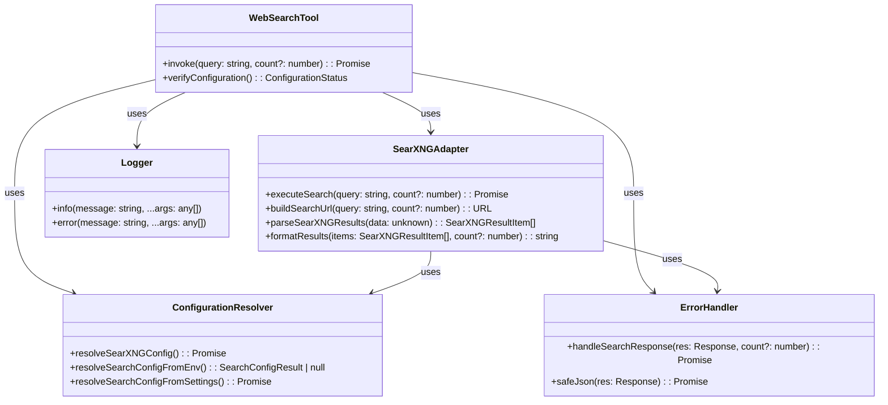
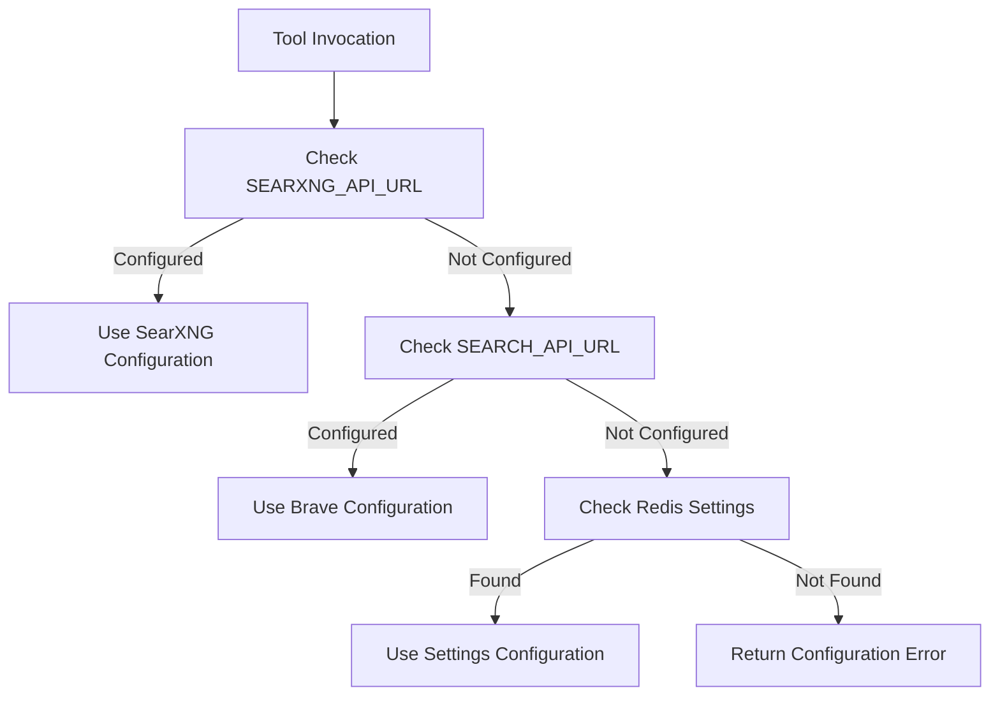
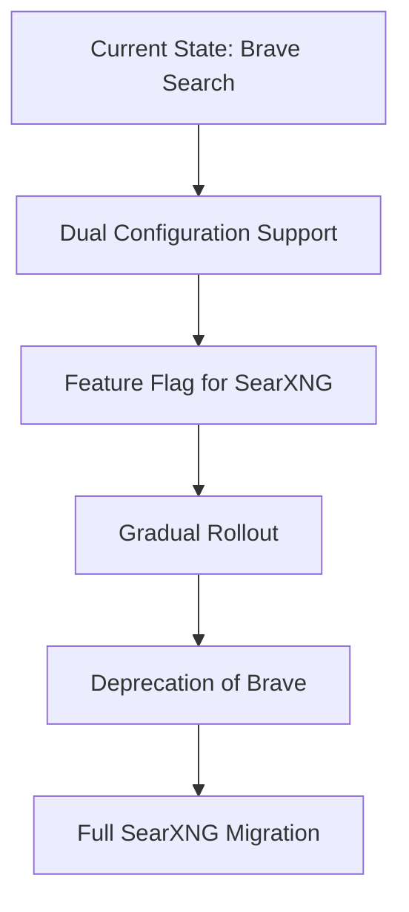
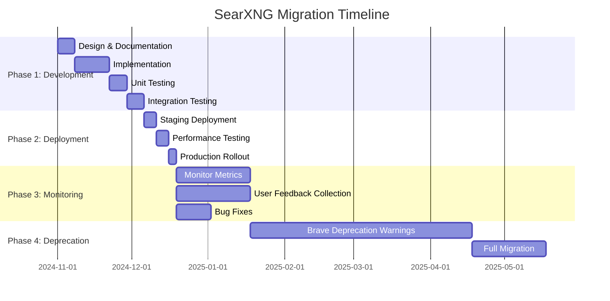
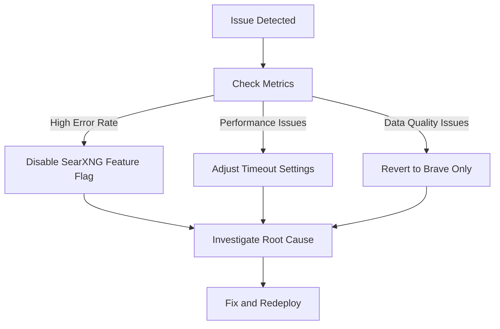

# SearXNG Web Search Tool Architecture Design

## Table of Contents

1. [Overview](#overview)
2. [Architecture Patterns and Component Structure](#architecture-patterns-and-component-structure)
3. [Configuration Management](#configuration-management)
4. [Error Handling and Validation Strategies](#error-handling-and-validation-strategies)
5. [API Integration Patterns](#api-integration-patterns)
6. [Backward Compatibility Considerations](#backward-compatibility-considerations)
7. [Testing and Monitoring Requirements](#testing-and-monitoring-requirements)
8. [Migration Plan](#migration-plan)

## Overview

This document presents the comprehensive architecture design for integrating SearXNG as a web search provider in the Bernard AI assistant, replacing the current Brave Search implementation while maintaining backward compatibility.

## Architecture Patterns and Component Structure

### Component Diagram



### Component Structure

```
web-search/
├── searxng-adapter.ts          # SearXNG-specific implementation
├── web-search.ts              # Main tool interface (updated)
├── types.ts                   # Type definitions
├── config.ts                  # Configuration management
└── errors.ts                  # Error handling utilities
```

### Key Components

1. **WebSearchTool**: Main interface that maintains backward compatibility
2. **SearXNGAdapter**: Implementation-specific logic for SearXNG API
3. **ConfigurationResolver**: Handles environment variables and settings fallback
4. **ErrorHandler**: Consistent error handling and response parsing
5. **Logger**: Integrated logging using existing pino setup

## Configuration Management

### Environment Variables Strategy

```typescript
// New SearXNG-specific environment variables
SEARXNG_API_URL=https://searxng.example.com/search
SEARXNG_API_KEY=optional-api-key-if-required

// Backward compatibility - existing variables still supported
SEARCH_API_KEY=brave-api-key  // Falls back to SearXNG if not configured
SEARCH_API_URL=https://api.search.brave.com/res/v1/web/search
```

### Configuration Resolution Flow



### Configuration Code Structure

```typescript
// Priority order: SearXNG env > Brave env > Settings
const SEARXNG_API_URL = process.env.SEARXNG_API_URL;
const SEARXNG_API_KEY = process.env.SEARXNG_API_KEY;

// Fallback to existing Brave configuration for backward compatibility
const SEARCH_API_KEY = process.env.SEARCH_API_KEY || process.env.BRAVE_API_KEY;
const SEARCH_API_URL = process.env.SEARCH_API_URL;

// Settings fallback from Redis
async function getSearchConfigFromSettings() {
  const settings = await getSettings();
  return settings?.services?.search || settings?.services?.searxng;
}
```

## Error Handling and Validation Strategies

### Error Handling Approach

```typescript
// Consistent error handling pattern
async function handleSearchResponse(res: Response, count?: number): Promise<string> {
  if (!res.ok) {
    const body = await res.text();
    logger.error('SearXNG API error: %s %s', res.status, res.statusText);
    return `Search failed: ${res.status} ${res.statusText}`;
  }
  
  try {
    const data = await res.json();
    const validatedData = searxngResponseSchema.parse(data);
    return formatResults(validatedData.results, count);
  } catch (error) {
    logger.error('Response parsing failed: %s', error.message);
    return 'Search failed due to invalid response format';
  }
}
```

### Validation Strategy

```typescript
// Zod schema for SearXNG response validation
const searxngResultSchema = z.object({
  title: z.string().min(1),
  url: z.string().url(),
  content: z.string().optional(),
  engine: z.string().min(1),
  score: z.number().optional()
});

const searxngResponseSchema = z.object({
  results: z.array(searxngResultSchema),
  query: z.string().optional(),
  number_of_results: z.number().optional()
});
```

### Error Types and Handling

| Error Type | Handling Strategy | User Message |
|------------|-------------------|--------------|
| Configuration missing | Fast fail with clear message | "Search tool is not configured" |
| Network error | Retry once, then fail | "Search service unavailable" |
| API error (4xx/5xx) | Log details, generic message | "Search failed: {status}" |
| Invalid response | Log parsing error | "Invalid search response" |
| Timeout | Fail fast | "Search request timed out" |

## API Integration Patterns

### SearXNG API Integration

```typescript
// SearXNG-specific URL building
function buildSearXNGUrl(apiUrl: string, query: string, count?: number): URL {
  const url = new URL(apiUrl);
  url.searchParams.set('q', query);
  url.searchParams.set('format', 'json');
  url.searchParams.set('pageno', '1');
  url.searchParams.set('language', 'en-US');
  
  if (count) {
    url.searchParams.set('num', String(Math.min(count, 8)));
  }
  
  return url;
}
```

### Request Execution Pattern

```typescript
async function executeSearXNGSearch(query: string, count?: number): Promise<string> {
  const config = await resolveSearchConfig();
  if (!config.ok) return config.reason;
  
  const url = buildSearXNGUrl(config.apiUrl, query, count);
  
  // Add SearXNG-specific headers if needed
  const headers: Record<string, string> = {};
  if (config.apiKey) {
    headers['Authorization'] = `Bearer ${config.apiKey}`;
  }
  
  try {
    const res = await fetch(url, {
      headers,
      timeout: 5000 // 5 second timeout
    });
    return handleSearchResponse(res, count);
  } catch (error) {
    logger.error('SearXNG request failed: %s', error.message);
    return 'Search service unavailable, please try again later';
  }
}
```

### Response Processing

```typescript
function parseSearXNGResults(data: unknown): SearXNGResultItem[] {
  try {
    const validated = searxngResponseSchema.parse(data);
    return validated.results.map(result => ({
      title: result.title,
      url: result.url,
      description: result.content || result.engine,
      engine: result.engine
    }));
  } catch (error) {
    logger.error('SearXNG response validation failed: %s', error.message);
    return [];
  }
}
```

## Backward Compatibility Considerations

### Migration Strategy



### Compatibility Matrix

| Configuration | Behavior |
|---------------|----------|
| Only SEARXNG_API_URL set | Use SearXNG |
| Only SEARCH_API_URL set | Use Brave (legacy) |
| Both set | Prefer SearXNG |
| Neither set | Check Redis settings |
| Settings available | Use configured provider |

### Deprecation Plan

1. **Phase 1 (Current)**: Dual support with SearXNG preferred
2. **Phase 2 (3 months)**: Warning logs for Brave usage
3. **Phase 3 (6 months)**: Deprecation warnings in admin UI
4. **Phase 4 (12 months)**: Remove Brave support entirely

### Configuration Migration

```bash
# Migration commands for environment variables
# From .env file:
sed -i 's/SEARCH_API_URL=.*/SEARXNG_API_URL=https:\/\/searxng.example.com\/search/' .env
sed -i 's/SEARCH_API_KEY=.*/SEARXNG_API_KEY=/' .env

# For Redis settings migration (admin UI or CLI)
# Update services.search to services.searxng
```

## Testing and Monitoring Requirements

### Testing Strategy

```typescript
// Test coverage requirements
describe('SearXNG Web Search Tool', () => {
  it('should use SearXNG when SEARXNG_API_URL is configured', async () => { /* ... */ });
  it('should fall back to Brave when SearXNG is not configured', async () => { /* ... */ });
  it('should handle SearXNG API errors gracefully', async () => { /* ... */ });
  it('should validate SearXNG response format', async () => { /* ... */ });
  it('should format results consistently with Brave format', async () => { /* ... */ });
  it('should respect count parameter limits', async () => { /* ... */ });
  it('should timeout after 5 seconds', async () => { /* ... */ });
});
```

### Monitoring Requirements

| Metric | Purpose | Implementation |
|--------|---------|----------------|
| Search request count | Track usage patterns | Prometheus counter |
| Search response time | Monitor performance | Prometheus histogram |
| Search error rate | Identify reliability issues | Prometheus counter |
| Provider usage | Track SearXNG vs Brave | Log-based metrics |
| Result count distribution | Analyze query effectiveness | Custom logging |

### Logging Strategy

```typescript
// Enhanced logging for observability
logger.info('Search request: query="%s" count=%d provider=%s', 
  query, count, config.provider);

logger.debug('SearXNG API response time: %dms status=%d', 
  responseTime, response.status);

logger.warn('Fallback to Brave search due to SearXNG configuration missing');
```

## Migration Plan

### Step-by-Step Migration



### Implementation Steps

1. **Add SearXNG environment variables** to `.env.example` and documentation
2. **Create SearXNG adapter** with full test coverage
3. **Update web-search tool** to support both providers
4. **Add configuration validation** for SearXNG-specific settings
5. **Implement monitoring** for provider usage and performance
6. **Update admin UI** to support SearXNG configuration
7. **Document migration guide** for existing users
8. **Deploy to staging** for integration testing
9. **Gradual production rollout** with feature flags
10. **Monitor and optimize** based on real-world usage

### Rollback Plan



## Summary

This architecture design provides a comprehensive plan for integrating SearXNG as the primary web search provider while maintaining full backward compatibility with the existing Brave Search implementation. The design follows Bernard's established patterns for configuration management, error handling, and modular architecture while providing a clear migration path and robust testing strategy.